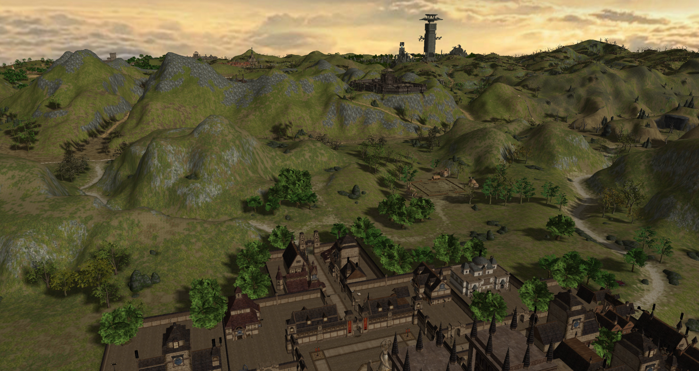
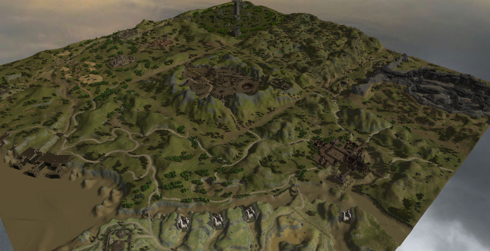
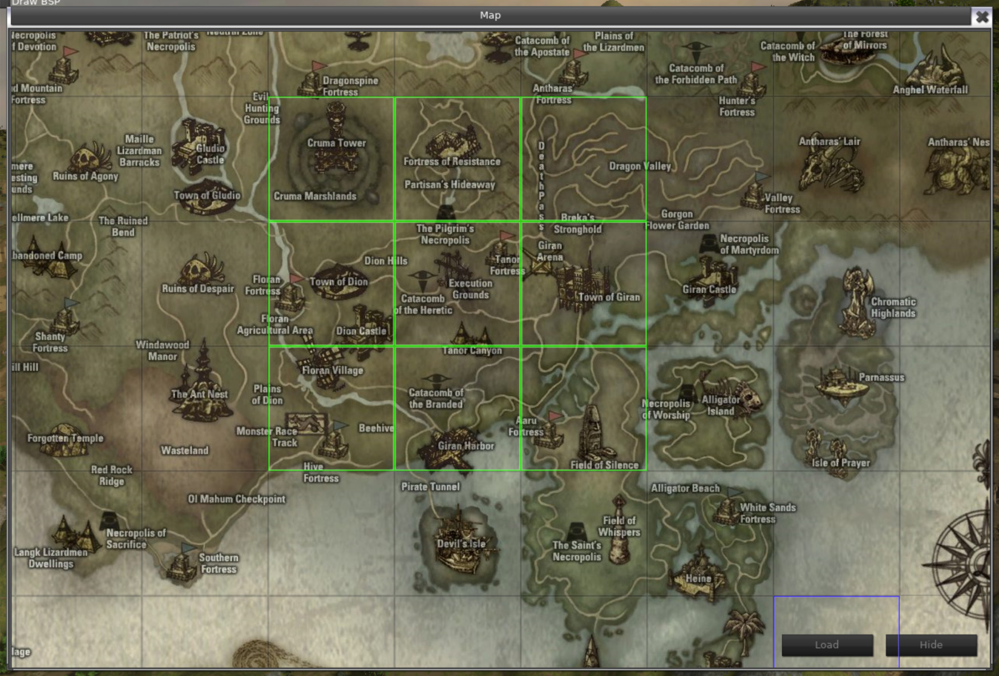
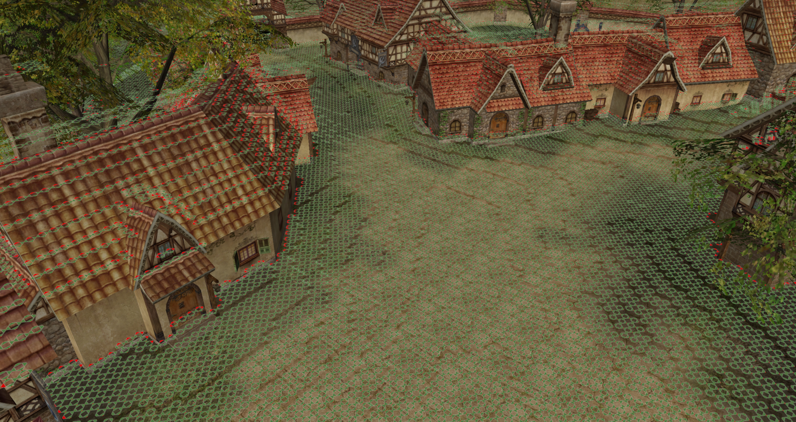

# Map viewer for Lineage II
_A memory from 2012. It's messy, but does the job._  
It can load any number of map tiles and lets you fly around using RMB and WSAD (+ Space & Ctrl). Tested on _Goddess of Destruction_, _C2_, and.. _C4_, i guess.  

**Attribution:** i'd taken base code for some UE entity types from.. can't really remember where : (
#### Running
Building may require some quite old libraries, so the easiest way is to grab binaries from the _Releases_ page. They are expecting to find L2 client folder at the parent directory, so put the _build_ folder at the same level as L2's _system_ folder.  
#### Building
In case you want to build it, grab _deps.zip_ from the last release and put it in the project root.  
#### Gallery

Also, if you'll put l2j geodata at the same level as _build_ folder (path should look like _geodat/**\_\**.l2j_), it will be displayed over geometry.  

